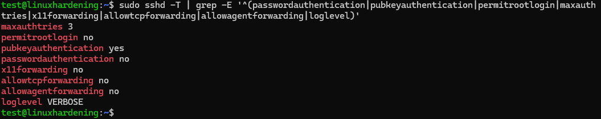
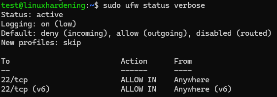
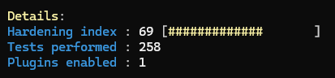

# linux-server-hardening-lab
A hands-on cybersecurity home lab focused on Linux server hardening, system security, monitoring, and vulnerability assessment.

# Linux Server Hardening Lab

A hands-on Ubuntu Server security project focused on system hardening, secure remote administration, firewall configuration, intrusion protection, logging, auditing, and vulnerability assessment.

## Project Overview

This lab began with a baseline Ubuntu Server installation running in Oracle VirtualBox and progressed through a series of security improvements.

Key areas included:

- Linux patch management
- User and privilege hardening
- SSH key-based authentication
- SSH configuration hardening
- UFW firewall deployment
- Fail2Ban intrusion protection
- System logging and auditing
- Lynis vulnerability assessment
- Post-remediation validation

## Environment

| Component | Configuration |
|---|---|
| Host | Windows |
| Hypervisor | Oracle VirtualBox |
| Guest OS | Ubuntu Server 26.04.1 LTS |
| Hostname | linuxhardening |
| RAM | 4 GB |
| CPUs | 2 |
| Disk | 25 GB |
| Network | VirtualBox NAT |
| SSH | Host port 2222 → Guest port 22 |

## Security Improvements

The server was hardened through a defense-in-depth approach.

```text
UFW Firewall
     ↓
Hardened SSH
     ↓
Key Authentication
     ↓
Fail2Ban
     ↓
Least Privilege
     ↓
Logging / Auditing
     ↓
Lynis Security Assessment
```

## Key Results

| Control | Before | After |
|---|---|---|
| UFW | Inactive | Active |
| Incoming policy | No UFW default deny | Default deny |
| SSH passwords | Enabled | Disabled |
| SSH keys | Not configured | Ed25519 authentication |
| Root SSH login | Restricted default | Explicitly disabled |
| Max SSH auth attempts | 6 | 3 |
| LXD membership | User was a member | Removed |
| Fail2Ban | Not installed | Active |
| Lynis hardening index | 65 | 69 |

## Evidence

### SSH Hardening



The final SSH configuration disables password authentication and root login while requiring public-key authentication and restricting unnecessary forwarding features.

### Firewall



UFW was configured with a default-deny inbound policy while explicitly allowing SSH.

### Fail2Ban


Fail2Ban monitors the SSH service and provides automated protection against repeated authentication failures.

### Authentication Auditing


System logs were reviewed to verify the transition from password-based authentication to public-key authentication.

### Vulnerability Assessment



Lynis was used to assess the system, review findings, implement selected remediation, and validate improvements.

The hardening index increased from **65 to 69** after selected SSH remediation.

## Documentation

Detailed project documentation is available in the [`documentation`](documentation/) directory.

The project covers the complete process from baseline assessment through final security validation.

## Skills Demonstrated

Linux administration, Ubuntu Server, SSH, Ed25519 authentication, UFW, Fail2Ban, systemd, journalctl, Linux users and groups, least privilege, vulnerability assessment, Lynis, VirtualBox networking, troubleshooting, Markdown, and GitHub documentation.

## Future Improvements

Future work will include controlled Fail2Ban testing from a Kali Linux VM, network-based vulnerability scanning, `auditd`, file-integrity monitoring, additional kernel hardening, and incident-response exercises.
