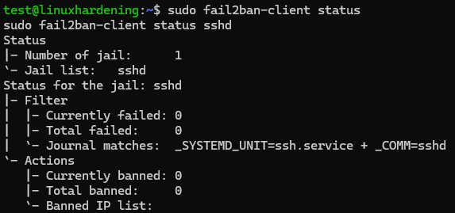
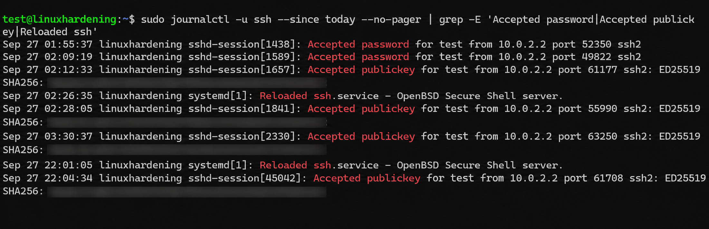

# linux-server-hardening-lab
A hands-on cybersecurity home lab focused on Linux server hardening, system security, monitoring, and vulnerability assessment.

# Linux Server Hardening Lab

A hands-on Linux security project focused on hardening an Ubuntu Server, securing remote administration, reducing unnecessary privileges, implementing firewall and intrusion protections, reviewing system logs, and performing a vulnerability assessment.

This project was built as a practical learning lab and documented to demonstrate both the technical changes made and the reasoning behind them.

---

## Project Overview

The lab began with a baseline Ubuntu Server installation running inside Oracle VirtualBox.

The server was then progressively hardened through several security layers:

- System patching and kernel updates
- User and privilege review
- Removal of unnecessary LXD group access
- OpenSSH installation and configuration
- Ed25519 public-key authentication
- SSH password authentication disabled
- Root SSH login disabled
- UFW host firewall
- Fail2Ban SSH protection
- Login and privileged-command auditing
- Lynis security assessment
- Post-remediation validation

---

## Lab Environment

| Component | Configuration |
|---|---|
| Host OS | Windows |
| Hypervisor | Oracle VirtualBox |
| Guest OS | Ubuntu Server 26.04.1 LTS |
| Hostname | `linuxhardening` |
| Architecture | x86_64 |
| RAM | 4 GB |
| CPUs | 2 |
| Virtual Disk | 25 GB |
| Network Mode | VirtualBox NAT |
| Guest IPv4 | `10.0.2.15` |
| SSH Guest Port | `22` |
| SSH Host Port | `2222` |

VirtualBox port forwarding was used to access the Ubuntu VM from the Windows host:

```text
Windows 127.0.0.1:2222
        ↓
VirtualBox NAT
        ↓
Ubuntu 10.0.2.15:22
```

---

## Defense-in-Depth Approach

The server was hardened using multiple complementary security controls rather than relying on one protection mechanism.

```text
             Network Traffic
                    ↓
               UFW Firewall
                    ↓
              Hardened SSH
                    ↓
        Public-Key Authentication
                    ↓
                Fail2Ban
                    ↓
         Linux Least Privilege
                    ↓
          Logging and Auditing
                    ↓
         Lynis Security Review
```

---

## Key Results

| Security Area | Initial State | Final State |
|---|---|---|
| System updates | Updates available | Updated |
| Kernel | `7.0.0-31` | `7.0.0-34` |
| UFW firewall | Inactive | Active |
| Incoming policy | No UFW default deny | Default deny |
| SSH server | Not initially installed | Installed and hardened |
| SSH passwords | Initially permitted | Disabled |
| SSH public keys | Not configured | Ed25519 authentication |
| Root SSH login | Restricted default | Explicitly disabled |
| Max SSH auth attempts | 6 | 3 |
| X11 forwarding | Enabled | Disabled |
| TCP forwarding | Enabled | Disabled |
| SSH agent forwarding | Enabled | Disabled |
| SSH logging | INFO | VERBOSE |
| LXD membership | User was a member | Removed |
| Fail2Ban | Not installed | Active |
| Login auditing | Not reviewed | Reviewed |
| Sudo auditing | Not reviewed | Reviewed |
| Vulnerability assessment | Not performed | Lynis completed |
| Lynis hardening index | 65 | 69 |

---

# Security Evidence

## SSH Hardening

The effective OpenSSH configuration was reviewed after hardening to verify that the intended controls were actually active.


Verified controls include:

- Public-key authentication enabled
- Password authentication disabled
- Direct root SSH login disabled
- Maximum authentication attempts reduced to 3
- X11 forwarding disabled
- TCP forwarding disabled
- SSH agent forwarding disabled
- Verbose SSH logging enabled

SSH configuration syntax was validated before service reloads using:

```bash
sudo sshd -t
```

A new SSH session was then opened to confirm that legitimate administrative access remained functional.

---

## UFW Firewall

UFW was configured as the host-based firewall.


Final policy:

```text
Incoming traffic: deny by default
Outgoing traffic: allow by default
SSH: TCP port 22 allowed
Logging: enabled
```

This reduces unnecessary inbound exposure while maintaining required remote administration.

---

## Fail2Ban SSH Protection

Fail2Ban was installed as an additional defensive layer for the SSH service.



The active `sshd` jail was verified and configured to monitor authentication activity through the systemd journal.

The reviewed thresholds were:

```text
Maximum retries: 5
Detection window: 600 seconds
Ban duration: 600 seconds
```

A deliberate ban was not generated from the Windows management connection because VirtualBox NAT causes management traffic to share the same lab-side path.

Controlled attack testing is planned from a separate Kali Linux VM.

---

## SSH Authentication Auditing

System logs were reviewed to reconstruct SSH authentication activity.



The journal showed the progression from earlier password-based authentication:

```text
Accepted password
```

to public-key authentication after hardening:

```text
Accepted publickey
```

The logs also recorded SSH configuration reload activity.

This demonstrated that system logs could be used to verify both authentication behavior and administrative changes.

---

## Lynis Security Assessment

Lynis was used to perform a host-based security assessment.


The first assessment reported:

```text
Tests performed: 258
Hardening index: 65
```

After reviewing the findings and implementing selected SSH hardening improvements, Lynis was run again.

Final result:

```text
Tests performed: 258
Hardening index: 69
```

The hardening index improved:

```text
65 → 69
```

The score was treated as an assessment indicator rather than a percentage of overall system security.

Scanner recommendations were reviewed individually instead of being applied automatically.

---

## Security Controls Implemented

### System Hardening

- Applied available system updates
- Updated the Linux kernel
- Reviewed interactive user accounts
- Verified the root password was locked
- Reviewed password-aging configuration
- Removed unnecessary LXD group membership

### SSH Security

- Installed OpenSSH Server
- Verified SSH host-key fingerprint
- Generated Ed25519 authentication keys
- Configured public-key authentication
- Disabled password authentication
- Disabled direct root login
- Reduced authentication attempts
- Disabled X11 forwarding
- Disabled TCP forwarding
- Disabled agent forwarding
- Increased SSH logging verbosity

### Network Protection

- Enabled UFW
- Configured default-deny inbound policy
- Allowed only required SSH access
- Enabled firewall logging

### Intrusion Protection

- Installed Fail2Ban
- Verified active SSH jail
- Reviewed retry and ban thresholds
- Verified systemd journal monitoring

### Logging and Auditing

- Reviewed historical login activity
- Inspected active systemd sessions
- Verified SSH connection information
- Reviewed SSH authentication logs
- Reviewed privileged `sudo` commands
- Identified system boot boundaries

### Security Assessment

- Installed Lynis
- Performed baseline security scan
- Reviewed scanner findings
- Investigated SSH recommendations
- Implemented selected remediation
- Validated SSH configuration
- Confirmed legitimate access
- Performed post-remediation scan
- Reviewed remaining findings

---

## Documentation

Detailed documentation for each phase of the lab is available in the [`documentation`](documentation/) directory.

1. [Lab Setup](documentation/01-lab-setup.md)
2. [Baseline Assessment](documentation/02-baseline-assessment.md)
3. [Security Updates](documentation/03-security-updates.md)
4. [User Hardening](documentation/04-user-hardening.md)
5. [SSH Hardening](documentation/05-ssh-hardening.md)
6. [Firewall](documentation/06-firewall.md)
7. [Fail2Ban](documentation/07-fail2ban.md)
8. [Logging and Auditing](documentation/08-logging-auditing.md)
9. [Vulnerability Scanning](documentation/09-vulnerability-scanning.md)
10. [Final Assessment](documentation/10-final-assessment.md)

---

## Skills Demonstrated

This project provided hands-on experience with:

- Ubuntu Server administration
- Linux command-line tools
- Linux package management
- Users and groups
- Principle of least privilege
- OpenSSH
- Ed25519 public-key authentication
- SSH configuration hardening
- VirtualBox networking
- NAT port forwarding
- UFW
- Fail2Ban
- systemd
- `journalctl`
- Login and session investigation
- Sudo auditing
- Linux environment variables
- Lynis security auditing
- Vulnerability remediation
- Risk-based security decisions
- Troubleshooting
- Markdown
- GitHub documentation

---

## Lessons Learned

One of the main lessons from this project was that system hardening is not simply about running commands or applying every recommendation produced by a scanner.

A more effective process is:

```text
Assess
  ↓
Understand
  ↓
Change
  ↓
Validate
  ↓
Test
  ↓
Document
  ↓
Reassess
```

The lab also reinforced that understanding what a command accomplishes is more important than memorizing every command from memory.

Security tools provide information and recommendations, but administrators still need to evaluate those findings based on the role and requirements of the system.

---

## Future Improvements

Future additions may include:

- Controlled Fail2Ban attack testing from Kali Linux
- Network-based vulnerability scanning
- `auditd`
- File-integrity monitoring
- Rootkit or malware scanning
- Additional kernel `sysctl` hardening
- Centralized logging
- Automated hardening scripts
- Incident-response exercises
- CIS Benchmark comparison

---

## Project Status

**Linux Server Hardening Lab — Complete**

The server progressed from a basic Ubuntu installation into a documented, layered hardening environment incorporating secure administration, firewall protection, intrusion monitoring, auditing, vulnerability assessment, and post-change validation.
